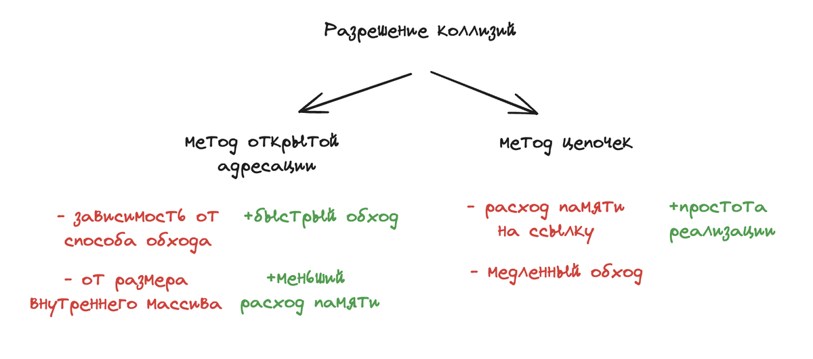

### Что такое мапа в го?

Мапа - это структура данных, которая содержит в себе пару ключ и значение.
Под капотом в ней хеш-таблица, которая позволяет нам обращаться по ключу за константное время.

Изначально создается мапа с 8 бакетами.
Бакет - структура данных, в которой хранится ключи и значения в мапе. Данные внутри бакета хранятся в виде массива, в одном бакете может быть до 8 элементов. Если все аллоцированые бакеты в среднем заполнены на 6,5, то начинается эвакуация данных.
Важное свойство для ключа - он должен быть comparable (сравнимый).
Нельзя взять указатель на элемент мапы как раз по причине эвакуации данных. Бакеты нужно для равномерного распределения данных.

#### Структура map
1) count - размер мапы
2) B - log_2 (логарифм) количества бакетов. Для 8 бакетов B=3, для 16 B=4 и так далее.
3) hash0     uint32 // seed для хэш-функции, генерируется при создании мапы. нужен для рандомизации хэш-функции
4) buckets    unsafe.Pointer // ссылка на массив из 2^B бакетов; nil, если count==0
5) oldbuckets unsafe.Pointer // ссылка на массив предыдущих бакетов. в процессе роста мапы здесь будет массив старых бакетов, откуда потихоньку будут переноситься значения в новые бакеты.

#### Переполнение бакета.
При переполнении бакета создается новый бакет и ссылка не него сохраняется в старом бакете. Ситуация переполнения бакета очень нежелательна.
Цифра 6.5 взято не случайно - это "идеальное" сочетание между переполнением и необходимым выделением памяти.
Похоже при этом эвакуация данных не происходит, просто создается еще один новый бакет. Этот процесс не быстрый, память выделяется, но она не инициализируется сразу. Если бы мы переносили данные сразу, после того, как выделили память, то некоторые операции внезапно начали бы работать медленно. Поэтому операции переноса выполняются в те моменты, когда мы выполняем операции сохранения или удаления ключей из мапы, это выполняется инкрементально. В ходе этого процесса данные равномерно распределяются по новым бакетам. Мы избежали пауз в выполнении операций, но теперь эти операции будут работать медленнее, потому что в момент эвакуации нужно будет смотреть в старые и в новые бакеты. Единственный способ избежать этих проблем выделять память для мапы под нужный размер заранее.

#### Эвакуация
Из-за эвакуации мы не можем взять указатель под элемент мапы. Компилятор не дает этого сделать. Потому что, если мы и возьмем указатель на элемент мапы, то после эвакуации данных указатель уже будет неактуальным - данные уже будут лежать в другом бакете и в другой ячейке памяти.

Эвакуация данных из бакета
Создается новый список бакетов, который будет в 2 раза больше чем предыдущий. И данные из старых бакетов будут скопированы в новые.

Эвакуация - процесс реорганизации и перераспределения элементов из старых корзин в новые корзины при расширении хеш-таблицы. Она происходит, когда количество элементов в map превышает определенный порог, происходит увеличение числа корзин, чтобы уменьшить вероятность коллизий и сохранить эффективность операций вставки, удаления и поиска. При увеличении 
Эвакуация происходит не сразу, только при чтении или записи к ним.
Эвакуация происходит через воркеры.

Записывать значения в неинициализированную мапу нельзя, будет паника.
Читать значения из неинициализированную мапу можно, получим zero-value.

### У нас есть хеш-функция, которая возвращает нам какой-то хеш. Хеш представляет из себя значение числа int64. Бакетов у нас меньше? Как вычислить в какой бакет положить пару ключ-значение?

Мы берем остаток от деления от количества бакетов.

### Что такое коллизия?

Коллизия — это ситуация при которой два разных входных элемента (ключа) дают одинаковое хеш-значение. При этом оба ключа будут помещены в один и тот же бакет в хеш-таблице. Существуют несколько методов решения коллизий. Чаще всего на собеседованиях упомниваются два нижеуказанных метода.

### Какие методы используются для решения коллизий и какой метод используется в го?

Методы решения коллизий:

#### 1. Метод открытой адресации.

Элементы мапы хранятся в массиве. При коллизии происходит поиск следующей свободной ячейки и вставка в нее элемента.

#### 2. Метод цепочек (применяется в го).

В ячейках массива хранятся не элементы мапы, а указатели на связный список, который хранит все элементы с одинаковым хешем. В случае коллизии новый элемент добавляется в этот список.

### Как создать мапу?

// неинициализированная мапа те m == nil

var m map[int]string 

// инициализированная мапа

m := map[int]string{}

m := make(map[int]string) или указать ёмкость мапы кторым параметром m := make(map[int]string, 1000) чтобы избежать "эвакуации"

### Что будет при попытке чтения и записи в непроинициалзированную мапу?
// при чтении zero value, при записе паника

### Как проверить есть ли значение в мапе или нет?
// val, ok := m[1]
